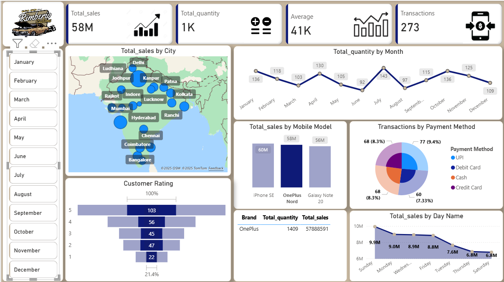

# 📊 Power BI Sales Dashboard

🚀 An **interactive Sales Dashboard** built in **Power BI**, designed to transform raw data into meaningful business insights.  

This project highlights sales performance, customer ratings, payment behaviors, and product trends — all in one place.  

---

## 📌 Dashboard Highlights
- **58M+ Total Sales** across multiple cities  
- **Customer Ratings & Behavior Trends**  
- **Transactions by Payment Method** (UPI, Debit, Cash, Credit)  
- **Month-by-Month & Day-wise Sales Tracking**  
- **Top Mobile Models Driving Revenue**  

---

## 🖼️ Dashboard Preview

---

## 📂 Repository Structure
POWER_BI_DASHBOARD/
│── 📁 icons/ # Icons used in dashboard
│── 📄 dashboard.pbix # Power BI dashboard file
│── 📄 dataset.xlsx # Dataset used for dashboard
│── 🎥 DB_CLIP.mp4 # Demo video (if <100MB)
│── 🖼️ logo.png # Dashboard logo
│── 🖼️ Thumbnail.png # Dashboard snapshot
│── 📄 README.md # Documentation

---

## 🛠️ Tools & Technologies
- **Power BI** – Data Modeling, DAX & Visualization  
- **Excel** – Raw dataset preparation  
- **Custom Icons & Design** – Enhanced dashboard experience  
- **Data Storytelling** – Turning numbers into decisions  

---

## 🎥 Demo
▶️ Watch the dashboard walkthrough video here:  
[Video Demo](DB_CLIP.mp4)  

*(If GitHub blocks due to file size >100MB, upload to Google Drive/YouTube and link here instead.)*  

---

## 🚀 Learning Outcomes
- Data Cleaning & Modeling in Power BI  
- Creating **KPIs & Metrics** (Sales, Quantity, Avg. Ratings, Transactions)  
- Designing **Interactive Visuals** (Maps, Slicers, Charts, Cards)  
- Applying **Data Storytelling** for business impact  

---

## 👨‍💻 Author
**Ahmer Mehmood**  
📧 Email: [ahmermehmood777@gmail.com](mailto:ahmermehmood777@gmail.com)  
💼 Portfolio: [datascienceportfol.io/ahmermehmoodzz7](https://datascienceportfol.io/ahmermehmoodzz7)  
🔗 LinkedIn: [linkedin.com/in/ahmermehmood7](https://www.linkedin.com/in/ahmermehmood7)  
📂 GitHub: [github.com/ahmermehmood7](https://github.com/ahmermehmood7)  

